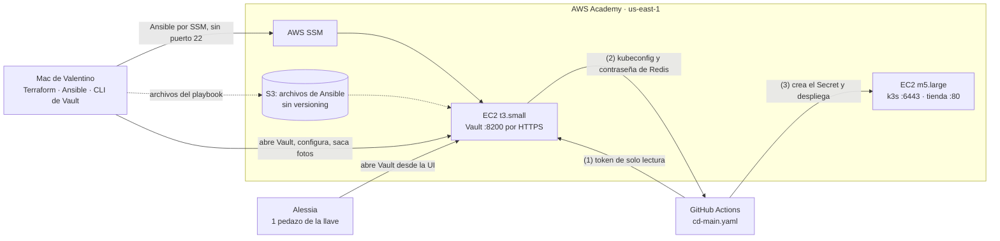

# ADR 0011 — Los secretos del pipeline se guardan en Vault, en su propia máquina

**Estado:** Aceptada · 2026-09-30

## Contexto

La Fase 3 pide sacar los secretos de donde están y guardarlos en un solo lugar: HashiCorp Vault. Vault se instala con Ansible, y el pipeline deja de tener sus secretos guardados en GitHub para pedírselos a Vault en cada despliegue. El plan que nos dio el profesor el 29 de septiembre lo reparte en cuatro semanas: la máquina y el diseño, el Ansible, la configuración de Vault con el pipeline, y las pruebas de fallas.

Ese plan da por hecho un servidor normal, y lo nuestro es distinto en tres cosas:

- **No entramos a las máquinas por SSH.** Desde el ADR 0010 el nodo de k3s no tiene el puerto 22 abierto; se entra por SSM. Ansible normalmente usa SSH.
- **El lab apaga las máquinas al cerrar la sesión**, y las vuelve a prender al iniciar la siguiente. Vault, cada vez que arranca, despierta sellado: no puede leer lo que guarda hasta que alguien lo abre. Eso va a pasar casi todos los días.
- **Casi no tenemos secretos.** El único propio es el kubeconfig del clúster, guardado como `KUBECONFIG_K3S` en el Environment `aws-k3s` de GitHub. `redis-orders`, la base de los pedidos, no tiene contraseña.

Antes de decidir comprobé los límites del lab, porque el diseño depende de ellos:

| Límite | Resultado | De dónde sale |
|---|---|---|
| Instancias encendidas a la vez | Hasta 9 instancias y 32 vCPU, tamaños `nano` a `large` | Readme del Learner Lab (actualizado el 24/06/2025). `aws service-quotas get-service-quota` responde `AccessDenied`, así que el lab no deja consultarlo por la CLI |
| KMS | El servicio está permitido y `aws kms list-keys` responde | Readme y CLI. Crear una llave propia no se probó, porque al final no hace falta (ver *Decisión*) |
| S3 desde una instancia con `LabInstanceProfile` | Sí: `LabRole` tiene permisos parecidos a los de la consola | Readme |
| Dominios | Route 53 no deja registrar ninguno | Readme |

## Decisión

**Vault vive en su propia EC2, fuera del clúster. Terraform crea la máquina, Ansible instala y configura Vault, y el pipeline le pide a Vault el kubeconfig y la contraseña de `redis-orders` en cada despliegue.** Una máquina aparte deja recrear Vault sin tocar la tienda, y un problema del clúster no se lleva la caja fuerte.

En el plan del profesor, Ansible construye el entorno. Aquí la máquina la crea Terraform, porque ya tenemos el módulo de `terraform/aws/`, y Ansible entra después a instalar Vault. Es la misma división que usamos con el nodo: Terraform hace el terreno y otra herramienta pone lo que va encima.

### Cómo se conectan las piezas

Vault solo abre el **8200**. Queda abierto a internet por la misma razón que el 6443 del nodo: los runners de GitHub no tienen IP fija. Sin un token válido no se pasa de la puerta.

### Las piezas del diseño

**1. Ansible entra por SSM, no por SSH.** Usa el plugin de conexión `amazon.aws.aws_ssm`, la misma puerta de servicio con la que ya entramos al nodo, y así ninguna máquina del proyecto tiene el 22 abierto. El plugin necesita un bucket de S3 para pasar archivos y el `session-manager-plugin` en la Mac. *Descartado:* SSH con la llave `vockey` que trae el lab y el 22 abierto solo a mi IP. Es más simple, pero es abrir una puerta en la máquina que guarda todos los secretos, en la fase que trata de seguridad.

**2. Se mudan a Vault dos secretos:** el kubeconfig del clúster y una contraseña nueva para `redis-orders` (#79), en un motor KV versión 2 bajo la ruta `boutique/`. No se mudan el `GITHUB_TOKEN`, que GitHub genera y destruye en cada job, ni mis llaves del lab, que caducan en cada sesión y son las que crean la máquina de Vault. En GitHub solo queda la credencial para hablar con Vault.

**3. El pipeline se identifica con un token**, como pide el plan: un token con una política de solo lectura sobre esos dos secretos, guardado como secreto del Environment `aws-k3s` y usado con `hashicorp/vault-action`. *Descartado por ahora:* el método JWT, donde GitHub le presenta a Vault una credencial firmada que genera en cada ejecución y no queda nada guardado. Es mejor práctica, pero lleva más configuración, se aparta del plan, y necesita el permiso `id-token: write` en el workflow, que amplía la regla 3 del ADR 0008 (`contents: read`). El bloqueo de OIDC que menciona el ADR 0010 no aplica aquí, porque quien valida la credencial es Vault y no IAM. Queda como mejora si sobra tiempo.

**4. Vault se abre a mano, con la llave partida en 3 pedazos y 2 necesarios** (Shamir). Yo guardo 2 pedazos en mi gestor de contraseñas y Alessia guarda 1. Ella puede abrir Vault desde la interfaz web sin entrar al lab. El token raíz se usa para configurar Vault y después se revoca. *Descartado:* que Vault se abra solo con KMS. Quita el paso diario, pero los pedazos se vuelven llaves de recuperación y el concepto que se califica ya no se demuestra; además, cualquiera con acceso a la cuenta de AWS podría abrirlo.

**5. La interfaz web va por HTTPS con una autoridad certificadora propia**, que genera Ansible junto con el certificado de Vault, con la IP elástica adentro. El certificado raíz no es secreto: va en el repo, en el llavero de mi Mac y en el parámetro `caCertificate` de `vault-action`. Así no se abre ningún puerto además del 8200. *Descartados:* Let's Encrypt con un nombre de sslip.io, que obliga a abrir el 80 y comparte el límite de certificados con todo el mundo (en febrero de 2026 se agotó, ver #68); y un dominio propio, que también pide el 80 y tiempo que la fase no tiene. Route 53 no deja registrar dominios, y los certificados de ACM no se instalan directo en una EC2.

**6. Vault guarda sus datos con `raft`**, el almacenamiento integrado que recomienda HashiCorp, en un solo nodo. *Descartado:* `file`, que es más simple pero no permite sacar fotos de Vault.

**7. Si hay que recrear la máquina, se restaura una foto.** Antes de destruirla, saco una foto con `vault operator raft snapshot save`, usando un token de respaldo con su propia política. En la máquina nueva se inicializa un Vault cualquiera y se le carga la foto con `vault operator raft snapshot restore -force`. Vault vuelve como estaba: los mismos pedazos de la llave, el mismo token del pipeline y los mismos secretos. La foto va cifrada con la llave de Vault y se queda en mi Mac, nunca en el repo. **Si no hay foto, se empieza de cero:** se inicializa otra vez, el script de #78 rehace la configuración, el kubeconfig se vuelve a sacar con `terraform output kubeconfig_comando` y la contraseña de Redis se genera nueva. La prueba de destruir y recrear de la semana 2 se hace con Vault vacío, antes de inicializarlo, así que ahí no se pierde nada.

**8. La máquina es una `t3.small`** (2 vCPU con ráfagas, 2 GiB). En el nodo descartamos las `t3` porque el `loadgenerator` gastaba sus créditos de CPU sin parar; Vault pasa casi todo el tiempo sin hacer nada, así que aquí sí sirven.

## Consecuencias

- **+** Los secretos salen de GitHub. Lo único que queda ahí es un token que solo puede leer dos secretos, que vence solo y que se revoca con un comando. Hoy, quien saque `KUBECONFIG_K3S` es administrador del clúster para siempre.
- **+** Cada lectura queda en la bitácora de auditoría de Vault: quién pidió qué y cuándo.
- **+** Cambiar la contraseña de Redis es cambiarla en Vault. El siguiente despliegue ya usa la nueva, sin tocar el pipeline.
- **+** Ninguna máquina del proyecto tiene el 22 abierto, y Vault solo expone el 8200.
- **+** Vault se puede recrear sin tocar la tienda: `terraform apply -replace=aws_instance.vault` rehace solo esa máquina.
- **−** **Vault despierta sellado en cada sesión.** Abrirlo se vuelve un paso de *Empezar el día*, y si se me olvida, el primer merge del día falla en el paso de Vault. No toca el clúster: se abre Vault y se le da *Re-run failed jobs*.
- **−** **Vault se vuelve un punto único para desplegar.** Si no responde, no hay despliegue. La tienda que ya está corriendo no se entera.
- **−** **El token del pipeline hay que renovarlo a mano** cuando venza. Es el precio de no usar JWT.
- **−** **Con dos personas, Shamir es más simbólico que real:** yo tengo suficientes pedazos para abrir Vault solo. En un equipo de verdad, cada pedazo lo tendría una persona distinta.
- **−** **La autoridad propia solo es de confianza donde se instala.** En mi Mac el navegador muestra el candado; si el profesor abre la URL desde su compu, verá una advertencia. En producción se usaría un dominio y una autoridad pública.
- **−** **SSM tiene más piezas que SSH:** el bucket, el plugin en la Mac y la colección `amazon.aws`, y es más lento. Además, cada archivo que Ansible manda pasa por S3 y podría llevar un secreto en texto plano. Por eso el bucket no tiene *versioning*, no es el del estado de Terraform, y la inicialización de Vault no la hace Ansible.
- **−** **Restaurar una foto depende de un token de respaldo** que hay que cuidar. Si se recrea sin foto, hay que redistribuir los pedazos, cambiar el token en GitHub y reiniciar Redis con la contraseña nueva.
- **−** Una máquina más en el lab: unos 10 USD al mes usándola a diario (la `t3.small` solo mientras está encendida, más la IP elástica y el disco), contra 50 USD de crédito. Y ahora hay que detener dos instancias al terminar el día.

## Referencias

Presentación de la Fase 3 del 29 de septiembre de 2026 · Readme del Learner Lab de AWS Academy · [ADR 0008](0008-despliegue-continuo-en-dos-fases.md) (reglas 1 y 3 del pipeline) · [ADR 0010](0010-fase-b-en-aws-con-k3s-sobre-ec2.md) (el clúster sin SSH) · [`terraform/aws/README.md`](../../terraform/aws/README.md) · #44 (los límites del lab) · #68 (HTTPS de la tienda y el límite de sslip.io) · los issues de la fase: #76 a #82
