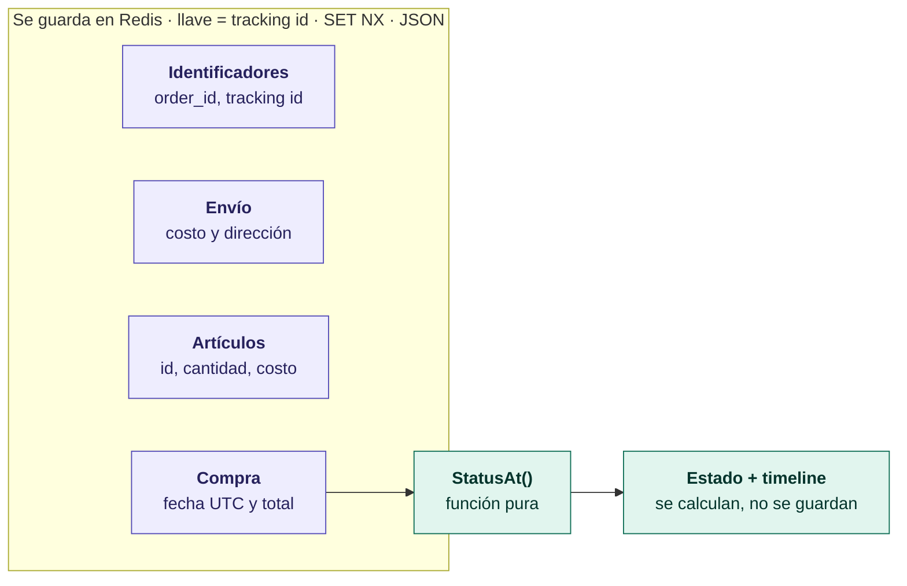
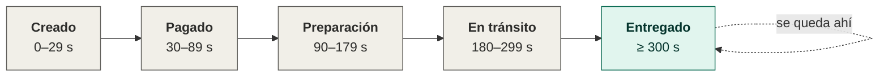

# Modelo del pedido y cálculo de estado

**Tarjeta:** #21 (Jira SCRUM-15) · **Sprint:** 2

Los ADR 0004 y 0005 ya dijeron *qué* hacer: Redis, el pedido completo como un solo valor y el estado calculado con el tiempo. Aquí lo aterrizamos a algo que se pueda programar. La idea es que, con esto cerrado, en #23 y #24 nadie tenga que volver a decidir nada de diseño.

---

## 1. Lo que decidimos

| # | La duda | Qué decidimos | Por qué |
|---|---------|---------------|---------|
| D1 | ¿En qué formato guardamos el pedido? | **JSON, pero generado con `protojson` desde el mensaje `Order`** (con `UseProtoNames: true`) | Nos quedamos con lo mejor de los dos: se lee con un `redis-cli GET` (útil para #28 y #46) y no hay que definir los tipos dos veces, porque el proto de #6 sigue siendo la fuente de verdad. |
| D2 | ¿Una variable por etapa o una sola con todo? | **Una por etapa**, en formato de duración de Go (`30s`, `5m`, `3h`) | Se entiende a la primera y en #28 se parchan una por una desde Kustomize sin broncas. |
| D3 | ¿Qué duraciones van por default? | **Las de modo revisión** (el ciclo dura como un día). Las de demo (5 min) entran con un *patch* de Kustomize | La tienda de #38 va a estar pública. Si alguien la revisa horas después con las duraciones cortas, todo le va a salir `DELIVERED` y no va a ver nada avanzar (justo lo que advierte el ADR 0005). |
| D4 | ¿Guardamos la dirección? | **Sí, pero no la regresamos** en la consulta | Ya quedó así en #6: está en `Order` pero no en `TrackedOrder`, tal como pide el ADR 0009. |
| D5 | ¿Guardamos el total? | **Sí** (`Order.total`) | `checkoutservice` ya lo calcula (`main.go:243-250`). Volver a sumarlo al consultar sería copiar la misma lógica en dos servicios. |
| D6 | ¿Qué pasa si la fecha de compra sale en el futuro? | **Lo tratamos como `CREATED`**, no como error | Si el reloj de un pod anda desfasado unos segundos, la consulta no debería tronar por eso. |
| D7 | ¿`DELIVERED` es el final del camino? | **Sí.** Ahí se queda para siempre | No manejamos cancelaciones ni devoluciones (ADR 0005). |
| D8 | ¿Regresamos la línea de tiempo con fechas? | **Sí.** Hay que agregar un campo en el contrato de #6 (ver §6) | Es lo que sugiere el ADR 0005 para que se vea el avance aunque el pedido ya haya llegado. |
| D9 | En la frontera exacta entre dos etapas, ¿cuál gana? | **La siguiente.** Los intervalos son `[inicio, fin)` y se compara con `<` | Así un pedido que cae justo en el segundo del cambio tiene una sola respuesta correcta. |
| D10 | ¿Cuál es la llave en Redis? | **El `shipping_tracking_id` tal cual**, sin prefijo, y se escribe con `SET … NX` | Redis es solo para esto, así que no hace falta prefijo. Y con `NX` es Redis el que se asegura de que el pedido se escriba una sola vez. |

---

## 2. Cómo se ve un pedido guardado

Por cada pedido guardamos **un solo valor**: el mensaje `Order` de `protos/demo.proto`, pasado a JSON con `protojson`.

Así se ve de un vistazo qué se guarda y qué se calcula:



| Campo | Tipo (proto) | ¿De dónde sale? | ¿Se guarda o se calcula? |
|-------|--------------|-----------------|--------------------------|
| `order_id` | `string` (UUID) | `checkoutservice`, con `uuid.NewUUID()` | Se guarda |
| `shipping_tracking_id` | `string`, de largo variable | `shippingservice`, con `CreateTrackingId` | Se guarda (y además es la llave) |
| `shipping_cost` | `Money` | `checkoutservice`, ya convertido a la moneda del usuario | Se guarda |
| `shipping_address` | `Address` | `PlaceOrderRequest.address` | Se guarda, pero **no se regresa** en la consulta (ADR 0009) |
| `items[]` | `repeated OrderItem` | `checkoutservice`, de `prep.orderItems` | Se guarda, dentro del mismo valor |
| `items[].item.product_id` | `string` | el carrito | Se guarda |
| `items[].item.quantity` | `int32` | el carrito | Se guarda |
| `items[].cost` | `Money`, precio **por pieza** en la moneda del usuario | `checkoutservice` | Se guarda |
| `purchased_at_unix` | `int64`, **segundos desde epoch en UTC** | `checkoutservice`, al momento de `PlaceOrder` | Se guarda |
| `total` | `Money` | `checkoutservice`, la misma variable `total` con la que se cobra | Se guarda |
| estado | `OrderStatus` | la función de §4 | **Se calcula** al consultar. Nunca se guarda |
| línea de tiempo | ver §6 | la función de §4 | **Se calcula** al consultar. Nunca se guarda |

Unas aclaraciones:

- **El dinero siempre va en `Money`** (`currency_code`, `units`, `nanos`), nunca en flotantes. Todo queda en la moneda con la que pagó el usuario; al consultar no se convierte a otra.
- **Los artículos** solo guardan `product_id`, `quantity` y `cost`, que es justo lo que ya trae `OrderItem`. No hay que inventar un tipo nuevo.
- **Ojo: hoy el total no viaja en `OrderResult`.** Cuando `checkoutservice` arme el `Order` para `RecordOrder` (#23), tiene que copiarlo de su variable local `total`.

### 2.1 Un ejemplo real

```
llave:  QK-48512-2407182
valor:
```
```json
{
  "order_id": "3f6c1a2e-9b7d-11ef-8c1a-0242ac120002",
  "shipping_tracking_id": "QK-48512-2407182",
  "shipping_cost": { "currency_code": "USD", "units": "8", "nanos": 990000000 },
  "shipping_address": {
    "street_address": "1600 Amphitheatre Parkway",
    "city": "Mountain View", "state": "CA", "country": "United States", "zip_code": 94043
  },
  "items": [
    { "item": { "product_id": "OLJCESPC7Z", "quantity": 2 },
      "cost": { "currency_code": "USD", "units": "19", "nanos": 990000000 } }
  ],
  "purchased_at_unix": "1790035200",
  "total": { "currency_code": "USD", "units": "48", "nanos": 970000000 }
}
```

Tres cosas de `protojson` que en #24 conviene tener en cuenta:

- Los `int64` (`units`, `purchased_at_unix`) salen **como texto entre comillas**. No es un error: así mapea proto3 a JSON, y `protojson.Unmarshal` los lee sin problema.
- El JSON que genera `protojson.Marshal` **puede cambiar de espaciado** entre versiones. Por eso en los tests se comparan los mensajes con `proto.Equal`, nunca el texto.
- Al leer usamos `protojson.UnmarshalOptions{DiscardUnknown: true}`. Así, si mañana agregamos un campo al proto, los pedidos que ya estaban guardados siguen leyéndose.

### 2.2 La llave (y un error en el ADR 0004)

> ⚠️ **El ejemplo `"OS-4A9F21"` del ADR 0004 está mal.** Se arrastró desde la propuesta §2.3.1. El generador de verdad (`src/shippingservice/tracker.go:23`) arma `%c%c-%d%s-%d%s`: dos letras, luego `len(salt)` pegado a 3 dígitos, y luego `len(salt)/2` pegado a 7 dígitos. O sea, **el largo cambia**. El patrón que valida su propio test es `^[A-Z]{2}-\d+-\d+$`.

- En ningún lado del modelo asumimos que el tracking id mide lo mismo siempre.
- La llave es el `shipping_tracking_id` tal cual, y el valor es un *string* de Redis.
- Se escribe con `SET <llave> <valor> NX`. Si la llave ya existe, `RecordOrder` responde `AlreadyExists` en lugar de pisar el pedido anterior. Así lo de "se escribe una sola vez" del ADR 0005 no depende de que el código se porte bien.
- Dato curioso que no afecta nada: `getRandomLetterCode` usa `rand.Intn(25)`, así que la `Z` nunca sale. No lo arreglamos aquí porque no es parte de esta tarjeta.

Le dejamos una nota al ADR 0004 que apunta a esta sección.

---

## 3. Los estados

Estos son los nombres exactos que van en el enum `OrderStatus` de `protos/demo.proto` (#6):

| Valor | Nombre en el código | Cómo se ve en pantalla | En el ADR 0005 |
|-------|---------------------|------------------------|----------------|
| 0 | `ORDER_STATUS_UNSPECIFIED` | — | (es el default de proto3; la función nunca lo regresa) |
| 1 | `ORDER_STATUS_CREATED` | Creado | `CREADO` |
| 2 | `ORDER_STATUS_PAID` | Pagado | `PAGADO` |
| 3 | `ORDER_STATUS_PREPARING` | En preparación | `EN_PREPARACIÓN` |
| 4 | `ORDER_STATUS_IN_TRANSIT` | En tránsito | `EN_TRÁNSITO` |
| 5 | `ORDER_STATUS_DELIVERED` | Entregado | `ENTREGADO` |

Van en inglés y con prefijo porque así lo pide la convención de proto3 y así ya empezó #6 con `ORDER_STATUS_UNSPECIFIED`. Los textos en español los pone el frontend.

---

## 4. La función que calcula el estado

### 4.1 Cómo se llama

```go
func StatusAt(purchasedAtUnix, nowUnix int64, d Durations) pb.OrderStatus
```

- **Es pura:** no toca Redis ni llama a `time.Now()` por dentro. El que la usa le pasa el `now` (en producción, `time.Now().UTC().Unix()`).
- Las duraciones entran como parámetro y no como variable global, para que cada test pueda usar las suyas.
- Todo va en **segundos enteros y en UTC**. El `now` se trunca a segundos antes de llamarla; así la frontera es exacta y no depende de fracciones de segundo.

### 4.2 Cómo decide

Si `d1…d4` son lo que dura cada etapa, las fronteras son:

```
T1 = d1
T2 = d1 + d2
T3 = d1 + d2 + d3
T4 = d1 + d2 + d3 + d4
e  = nowUnix - purchasedAtUnix        (segundos que han pasado)
```

| Si… | El estado es |
|-----|--------------|
| `e < T1` (aunque `e` sea negativo) | `ORDER_STATUS_CREATED` |
| `T1 ≤ e < T2` | `ORDER_STATUS_PAID` |
| `T2 ≤ e < T3` | `ORDER_STATUS_PREPARING` |
| `T3 ≤ e < T4` | `ORDER_STATUS_IN_TRANSIT` |
| `e ≥ T4` | `ORDER_STATUS_DELIVERED` |

En pocas palabras: se compara con **`<`**, y la frontera ya cuenta como la etapa **siguiente**.

Con los valores de demo (ciclo de 5 minutos) queda así:



> En el segundo 30 exacto el pedido ya es **Pagado**, no Creado. Con fechas en el futuro (e < 0) sale **Creado**.

### 4.3 Tabla de casos

Usa los valores de demo (`d1=30s, d2=60s, d3=90s, d4=120s`, o sea `T1=30, T2=90, T3=180, T4=300`). Está hecha para que en #13 y #25 se copie casi tal cual como test *table-driven*.

| # | Caso | `e` (s) | Estado esperado |
|---|------|--------:|-----------------|
| 1 | La fecha viene del futuro (reloj desfasado) | −10 | `CREATED` |
| 2 | **Borde: t = 0** | 0 | `CREATED` |
| 3 | Último segundo de CREATED | 29 | `CREATED` |
| 4 | **Borde: justo en la frontera CREATED → PAID** | 30 | `PAID` |
| 5 | Último segundo de PAID | 89 | `PAID` |
| 6 | Frontera PAID → PREPARING | 90 | `PREPARING` |
| 7 | Último segundo de PREPARING | 179 | `PREPARING` |
| 8 | Frontera PREPARING → IN_TRANSIT | 180 | `IN_TRANSIT` |
| 9 | Último segundo de IN_TRANSIT | 299 | `IN_TRANSIT` |
| 10 | Frontera IN_TRANSIT → DELIVERED | 300 | `DELIVERED` |
| 11 | **Borde: ya pasó muchísimo más que la suma** | 1 000 000 | `DELIVERED` |
| 12 | El número más grande posible (que no se desborde) | `math.MaxInt64 − purchasedAt` | `DELIVERED` |

El caso 12 nunca va a pasar con fechas reales, pero obliga a calcular `e` sin desbordar y el test cuesta una línea.

---

## 5. Cuánto dura cada etapa

`DELIVERED` no tiene duración porque ahí se queda. Por eso son cuatro variables y no cinco.

| Etapa | Variable de entorno | Default (modo revisión) | Demo |
|-------|---------------------|------------------------:|-----:|
| CREATED → PAID | `ORDER_CREATED_DURATION` | `5m` | `30s` |
| PAID → PREPARING | `ORDER_PAID_DURATION` | `30m` | `60s` |
| PREPARING → IN_TRANSIT | `ORDER_PREPARING_DURATION` | `3h` | `90s` |
| IN_TRANSIT → DELIVERED | `ORDER_IN_TRANSIT_DURATION` | `20h` | `120s` |
| **Todo el ciclo** | | **≈ 23 h 35 min** | **5 min** |

Las reglas:

- **Formato:** el de `time.ParseDuration` de Go.
- **Se validan al arrancar:** cada una tiene que ser de al menos `1s` y en segundos cerrados. Si una variable no viene, se usa el default. Si viene pero con un valor inválido, **el servicio no arranca**. Preferimos que truene de frente a que use un default en silencio y nadie se dé cuenta.
- **¿Por qué el default es el modo revisión?** Porque la tienda de #38 va a estar pública. Así, quien entre horas después todavía ve el pedido avanzando, y en los primeros 5 minutos ya ve un cambio de estado. Para la demo, en #28 se aplica un *patch* de Kustomize que cambia las cuatro variables.
- **Algo que hay que saber:** como el estado se calcula, **si cambias una duración, cambia el estado de todos los pedidos que ya existen**. No es un bug: no hay nada guardado que migrar.

---

## 6. La línea de tiempo (aviso para #6)

Sí la vamos a regresar. Para eso hay que agregar esto a `TrackedOrder` en `protos/demo.proto`:

```proto
message StatusStep {
    OrderStatus status = 1;
    // Segundos Unix en UTC en que empieza (o va a empezar) la etapa.
    int64 starts_at_unix = 2;
}

message TrackedOrder {
    // … los campos 1–5 se quedan igual …
    // Las cinco etapas en orden, incluidas las que todavía no llegan.
    repeated StatusStep timeline = 6;
}
```

Se calcula con las mismas fronteras de §4.2: CREATED empieza en `purchased_at`, y cada etapa siguiente en `purchased_at + T1`, `+ T2`, `+ T3` y `+ T4`. El frontend marca como alcanzadas las que tengan `starts_at_unix ≤ now`, o simplemente las que estén en o antes de `status`. Tampoco se guarda nada de esto: todo sale del cálculo.

---

## 7. Lo que no guardamos (y por qué)

| Dato | Por qué no |
|------|------------|
| El estado y la línea de tiempo | Salen del tiempo (ADR 0005). Si los guardáramos, necesitaríamos un proceso que los fuera actualizando. |
| Nombre, imagen, descripción y precio de catálogo del producto | Le pertenecen a `productcatalogservice`. Se piden al pintar la pantalla, igual que ya lo hace el carrito en `src/frontend/handlers.go:285` (ADR 0004). |
| Correo del comprador, `user_id`, datos de la tarjeta y `transaction_id` | Para rastrear no hacen falta. Además, la consulta es anónima y los números se pueden adivinar (ADR 0009): entre menos datos personales guardemos, mejor. |
| El precio en otras monedas | Solo guardamos lo que el usuario realmente pagó. |

**¿Y si un producto ya no existe en el catálogo?** La pantalla muestra el `product_id` en lugar del nombre y no pone imagen. La consulta **no truena** (ADR 0004).

---

## 8. Pendientes para otras tarjetas

- **#6:** agregar los cinco valores de `OrderStatus` de §3, y `StatusStep` con `TrackedOrder.timeline` de §6.
- **#23:** `checkoutservice` tiene que copiar `total` y `purchased_at_unix` (en UTC y en segundos) al `Order`. La consulta llama a `StatusAt` con el `now` truncado a segundos.
- **#24:** la llave es el tracking id tal cual; se escribe con `SET … NX`; se usa `protojson` con `UseProtoNames` al escribir y con `DiscardUnknown` al leer.
- **#28:** el *patch* de Kustomize con las cuatro variables de §5 en valores de demo.
- **#13 / #25:** la tabla de §4.3 es básicamente el test.

---

## Revisión

- [ ] Lo revisó el otro integrante del equipo
- [x] Se le dejó la nota al ADR 0004 con la corrección de §2.2
